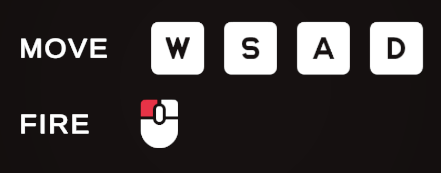
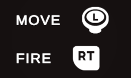

# Input Hints

A lightweight, sprite-based input hint system for **Unity's Input System and UGUI**. Automatically swaps controller prompts (keyboard, mouse, gamepads including Xbox, PlayStation, Switch, Steam Deck, and Steam Controller) based on the active device, with layout-agnostic lookups and parent-path fallback. _Inspired by **[Input Glyphs](https://github.com/eviltwo/InputGlyphs)** by eviltwo_.

<div style="display:flex; gap:12px; flex-wrap:wrap; align-items:stretch;">
  <div style="flex:1 1 280px; max-width:49%;">
    
  </div>
  <div style="flex:1 1 280px; max-width:49%;">
    
  </div>
</div>

## Requirements

- **Unity** 2021.3+
- **Packages** (add via Package Manager if needed): **[Input System](https://docs.unity3d.com/Packages/com.unity.inputsystem@latest), TextMeshPro, Unity UI (UGUI)**.

---

## Features

- **Sprite-first** — `HintMapSO` stores control path → sprite entries for fast resolution through registered providers.
- **TextMeshPro** — Each hint map can reference a `TMP_SpriteAsset`. `HintTMPText` applies the correct asset for the active device and can replace `<action=ActionName>` tags in your copy with resolved `<sprite>` markup at runtime.
- **Device-aware gamepads** — `GamepadHintProvider` picks maps by detected subtype (Xbox, DualShock, Switch, Steam Deck, Steam Controller, or fallback).
- **Composites** — `HintComposite` pools `HintImage` children for multi-binding actions (e.g. WASD) under a layout container.
- **Optional providers** — Separate initializers for keyboard, mouse, touchscreen, and joystick so you only register what you ship.

---

## Installation

### Via Unity Package Manager (Git URL)

1. Open **Window > Package Manager**.
2. Click **+** → **Add package from git URL...**.
3. Paste the URL and click **Add**:

```console
https://github.com/Tirtstan/Input-Hints.git
```

To pin a version, append a tag:

```console
https://github.com/Tirtstan/Input-Hints.git#v2.0.0
```

### Via `manifest.json`

Add to `Packages/manifest.json`:

```json
{
    "dependencies": {
        "com.tirt.input-hints": "https://github.com/Tirtstan/Input-Hints.git"
    }
}
```

---

## Quick start

### Sample (recommended)

This package includes a **Quick Start** sample you can import from the Package Manager. It comes with **[Kenney's input prompt sprites](https://kenney.nl/assets/input-prompts)** and **pre-configured hint maps** (`HintMapSO`) so you can see everything working immediately and copy the setup into your project.

- In Unity: **Window > Package Manager** → select `com.tirt.input-hints` → **Samples** → **Quick Start** → **Import**.

### From Scratch

1. Create one or more **Hint Map** assets (**Assets > Create > Input Hints > Hint Map**). For each entry, set the control path (e.g. `buttonSouth`, `a`, `space`) and assign sprites (and optional TMP sprite names). If you import the **Quick Start** sample (below), you can skip this step to start.
2. Add **provider initializer** components to a bootstrap scene (order defines query order):

- **Gamepad Hint Provider** — assign fallback and subtype maps as needed.
    - **Keyboard / Mouse / Touchscreen / Joystick Hint Provider** — assign ordered `HintMapSO` arrays for each device category you support.

1. Add UI or world display components and wire **Player Input** plus the **action name** (and **binding index** if the action has multiple bindings).

| Component            | Use case                                                                                 |
| -------------------- | ---------------------------------------------------------------------------------------- |
| `HintImage`          | UGUI `Image` hints (`ILayoutElement` optional)                                           |
| `HintSpriteRenderer` | World-space / 2D `SpriteRenderer`                                                        |
| `HintComposite`      | Multiple bindings (e.g. value-type action, vector2) via pooled child `HintImage` prefabs |
| `HintTMPText`        | TMP text: device-appropriate sprite asset + `<action=...>` replacement                   |
