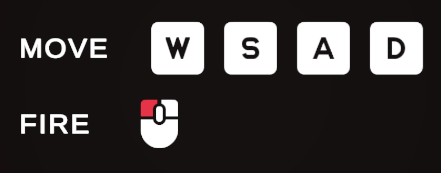
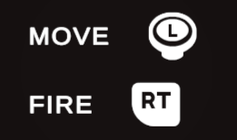

# Input Hints

A lightweight, sprite-based input hint system for **Unity's Input System and UGUI.** Automatically swaps controller prompts (keyboard, mouse, gamepads including Xbox, PlayStation, Switch, Steam Deck, and Steam Controller) based on the active device, with layout-agnostic lookups and parent-path fallback. _Inspired by **[Input Glyphs](https://github.com/eviltwo/InputGlyphs)** by eviltwo_.

[**Installation**](#installation) | [**Quick Start**](#quick-start) | [**Features & Components**](#features--components)

<div style="display:flex; gap:12px; flex-wrap:wrap; align-items:stretch;">
  <div style="flex:1 1 280px; max-width:49%;">
    
  </div>
  <div style="flex:1 1 280px; max-width:49%;">
    
  </div>
</div>

## Features & Components

- **Hint maps** — `HintMapSO` maps control paths to sprites (and optional TMP sprite names).
- **Providers** — Register keyboard, mouse, gamepad (PlayStation, XBOX, Switch, Steam Deck, Steam Controller), touchscreen, or joystick maps via initializer components.
- **Display** — `HintImage` (UGUI), `HintSpriteRenderer` (world space), `HintComposite` (action-driven composites), and `HintRow` (caller-supplied paths with all-or-nothing fallback).
- **TextMeshPro** — `HintTMPText` swaps the device sprite asset and replaces `<action="ActionName">` tags with `<sprite>` markup.
- **Scriptable** — Inspector fields are public; set or read them from code at runtime. Call `RefreshHints()` on display components, `UpdateHints()` / `SetText()` on `HintTMPText`, or use `HintManager` directly for resolution.

| Component             | Use           | Main properties                                           |
| --------------------- | ------------- | --------------------------------------------------------- |
| `HintMapSO`           | Asset         | Entries (path, glyph, TMP name), TMP Sprite Asset         |
| `HintImage`           | UGUI          | Player Input, Action Name, Binding Index, Image           |
| `HintSpriteRenderer`  | World / 2D    | Player Input, Action Name, Binding Index, Sprite Renderer |
| `HintComposite`       | Multi-binding | Player Input, Action Name, Child Prefab, Container        |
| `HintRow`             | Path row      | Control Paths, Devices, Child Prefab, Container           |
| `HintTMPText`         | TMP text      | Target Text, Player Input, Input Action Names             |
| Provider initializers | Bootstrap     | Hint Map(s) per device type                               |

TMP example: `Press <action="Jump"> to jump.`

> `PlayerInput` notification behavior must be **Invoke Unity Events** or **Invoke C# Events** for automatic device-change updates.

---

## Installation

**Requirements:** Unity 2021.3+ and **[Input System](https://docs.unity3d.com/Packages/com.unity.inputsystem@latest), TextMeshPro, Unity UI (UGUI)** (add via Package Manager if needed).

### Via Unity Package Manager (Git URL)

1. Open **Window > Package Manager**.
2. Click **+** → **Add package from git URL...**.
3. Paste the URL and click **Add**:

```console
https://github.com/Tirtstan/Input-Hints.git
```

> ^ will always mirror latest release (`main` branch).

To install a specific version, append a tag:

```console
https://github.com/Tirtstan/Input-Hints.git#v2.1.0
```

### Via `manifest.json`

Add to `Packages/manifest.json`:

```json
{
    "dependencies": {
        "com.tirt.input-hints": "https://github.com/Tirtstan/Input-Hints.git"
    }
}
```

---

## Quick Start

### Sample (recommended)

This package includes a **Quick Start** sample you can import from the Package Manager. It comes with **[Kenney's input prompt sprites](https://kenney.nl/assets/input-prompts)** and **pre-configured hint maps** (`HintMapSO`) so you can see everything working immediately and copy the setup into your project.

- In Unity: **Window > Package Manager** → select `com.tirt.input-hints` → **Samples** → **Quick Start** → **Import**.

### From Scratch

1. Create one or more **Hint Map** assets (**Assets > Create > Input Hints > Hint Map**). For each entry, set the control path (e.g. `buttonSouth`, `a`, `space`) and assign sprites (and optional TMP sprite names). If you import the **Quick Start** sample (below), you can skip this step to start.

2. Add **provider initializer** components to a bootstrap scene (order defines query order):
    - **Gamepad Hint Provider** — assign fallback and subtype maps as needed.
    - **Keyboard / Mouse / Touchscreen / Joystick Hint Provider** — assign ordered `HintMapSO` arrays for each device category you support.

3. Add UI or world display components and wire **Player Input** plus the **action name** (and **binding index** if the action has multiple bindings).

For UI that already resolves its own binding paths, call `HintRow.TryShow(devices, paths)`. If no matching device is connected, the row uses each path's device layout for unbound resolution. Use full paths such as `<Keyboard>/space` or `<Gamepad>/buttonSouth` so providers cannot select a different device family.

---
